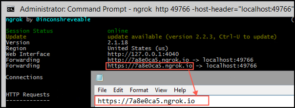

Environment Setup Instructions
===================

## Provision environment (Skytap)

- Template: Okta ICE DC
  - 4 CPUs
  - 4 gb RAM

## MySQL

1. Go to [My SQL Installer Page](https://dev.mysql.com/downloads/installer/).
2. Download `mysql-installer-community-5.7.17.0.msi` (the biggest Windowsbinary)

    

3. Launch and install with the Default options.

    ```java
    public static void Main(String args[]){
      System.out.println("Hello World");
    }
    ```

4. Proceed with the default options for all screens except:
    - Password: enter `Welcome1`.
    - Service: do not start MySQL when the machine is started.

6. Complete the setup with the default options.
7. The Workbench will be launched.
8. Log into mysql and save the password.
9. Click Import. Import the single file `emp.sql`.
10. Expand the employees schema and test the data in the employees table.
11. Delete the other schemas provided with MySQL.
12. Stop the server.

## JDK

1. Download JDK 7 here: [Oracle JDK Download page](http://www.oracle.com/technetwork/java/javase/downloads/java-archive-downloads-javase7-521261.html)
2. Launch and execute the installer.
3. Record the installation path.

## Tomcat

1. Go to [Tomcat download page](https://tomcat.apache.org/download-60.cgi)
2. Download the 32-bit/64-bit Windows Service Installer.
3. Launch the installer and proceed with the default options.
4. Select the JDK 7 path as the JDK for use.
5. After setup, stop the server.

## Install Postman

1. Install Postman for Windows.
2. Test a Postman request to make sure Postman can hit the Internet.
3. Close Postman and create a shortcut in the desktop.


## Configure the Hosts file

1. Launch Notepad as Administrator.
2. Open the hosts file (`C:\Windows\System 32\drivers\etc\hosts`).
3. Add the entry `127.0.0.1 mysql legacy.oktaice.com`
4. Save and close.

## Shortcuts

1. In the bottom-right corner, make both MySQL and Tomcat available without expanding the menu.

### Install OPP binaries

1. Download the [`opp_win.zip`](opp_win.zip) file under `C:\Users\Administrator\Downloads` and unzip its contents.
2. Copy the labs folder to `C:\`.

### Test Tomcat connection

1. Launch Chrome.
2. Access [http://legacy.oktaice.com:8080](http://legacy.oktaice.com:8080).
3. Confirm that Tomcat Home is displayed.
4. Click **Manager**. Log in as `tomcat` / `Tra!nme4321`.
5. Confirm that the Tomcat Manager home is displayed.
6. Stop the servers.

## Expand terminal

1. Launch terminal, right-click the top-right corner, and then click Properties.
2. Under Layout, change the Screen Buffer Size Width to 300 and save.
3. To test, launch CMD again and maximize it.

## Set Atom as default text editor.

1. Right-click a text file.
2. Change the default app to open it.

## Install OIDC Lab
1. Install Postman for Windows.
2. Go to [Okta Developers](http://developer.okta.com/docs/api/resources/oauth-clients.html) and download the **Client Application API** collection.
3. Register the Okta ICE environment with the following variables:
    ```
    url:
    clientId:
    clientSecret:
    redirectUri:
    serviceClientId:
    serviceClientSecret:
    authorizationServerId:
    accessToken:
    ```

## Install API as a Master Lab
1. Download the apimaster.zip file under `C:\Users\Administrator\Downloads` and unzip its contents.
2. Copy the labs folder to `C:\labs`.
3. Launch Postman
4. Import the User and Environment collections from [Okta Developers](http://developer.okta.com/docs/api/getting_started/api_test_client.html).
5. Import the API as a Master collection from `C:\labs\apimaster`.

## Install idp-discovery Lab
1. Download the idpdiscovery.zip file under `C:\Users\Administrator\Downloads` and unzip its contents.
2. Copy the labs folder to `C:\labs`.

## Install SAML tracer
1. Launch Firefox.
2. Go to Add Ons.
3. Search and install `SAML tracer`.
4. To confirm that its installed, click the hamburger menu (top-right corner) > SAML tracer. (the SAML tracer window should appear).

## Install RADIUS test client
1. Set Google Chrome as default browser (Chrome Settings > Search for Default > Set as default)
2. Go to (RadLogin download page)[http://bit.ly/rtestclient]
3. Download Radlogin for x86 Windows.
4. Run the Installer. Setup with default options.
5. Go to start menu and launch the Radius test client (localhost:8020 should be displayed).
6. Set `Tra!nme4321` as password.
7. Login as admin/Tra!nme4321.
